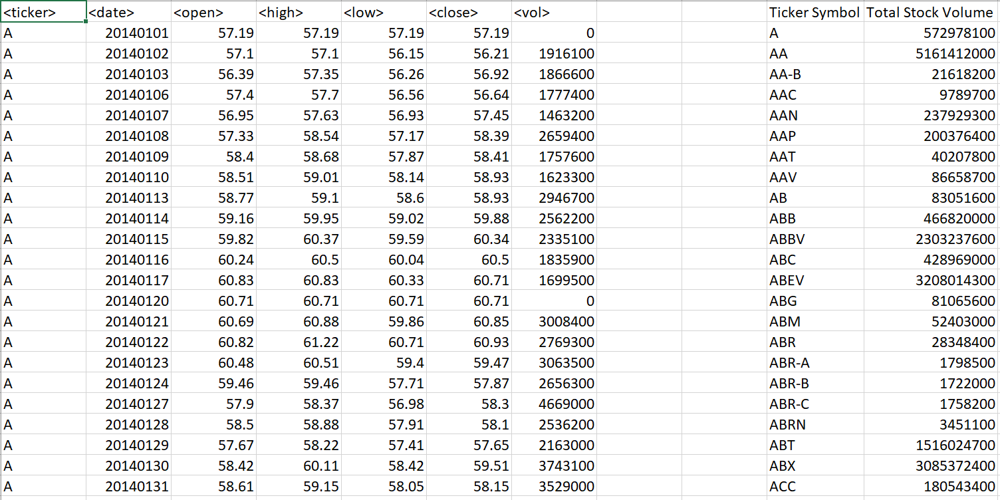

# VBA

Using Excel File with over 7000,000 rows of stock market data

Script will loop through all the stocks for one year for each run and take the following information.

* The ticker symbol

* The total stock volume of the stock.

